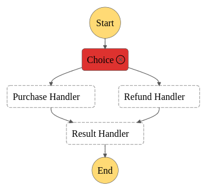

# ETL Serverless with AWS
- This project has only the purpose to study how FAAS can be used instead off a server application.

## Intro
- In lambda_functions directory there is 3 python files which represents a used lambda_function in the creation of the simple workflow with these Lambda Functions:
    
    * __purchase_handler.py:__
        
        - A very simple function which returns the following dictionary: {"result": "PURHCASE_PROCESSED_SUCCESSFULLY"}
    
    * __refund_handler.py:__

        - A very simple function which returns the following dictionary: {"result": "REFUND_PROCCESS_SUCCESSFULLY"}

    * __result_handler.py:__

        - A simple function which uses string interpolation to return a with the content of the previous lambda function: {"body": f"{previous_result}_RESULT"}
- In the AWS Step Function Section, you must create the following workflow, and set to each State the respective aws lambda function:

    * 
    
    - Step Functions Graph defining the Start, the Choice State, each lambda function and finally the End.

    *
    
    - In the case of execute the Step Function with the json: {"type": "PURCHASE"}

    *
    
    - In the case of execute the Step Function with the json: {"type": "REFUND"}

    *
    
    - In the case of execute the Step Function with anyone json other than those listed above: {"type": "REFUND"}

- In the ASL directory, a file with the Amazon State Language which define our State Machine can be found.

## Next Step
- Create an ETL with Lambda Functions;
- Create a TerraForm script to automate;